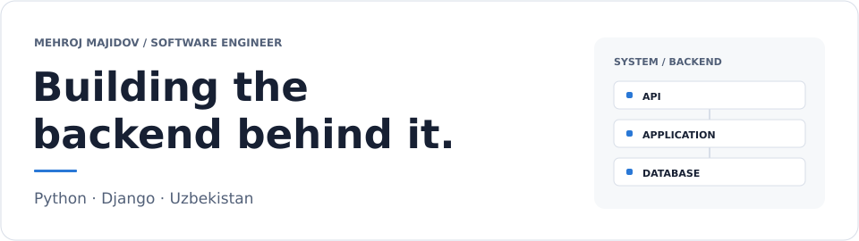
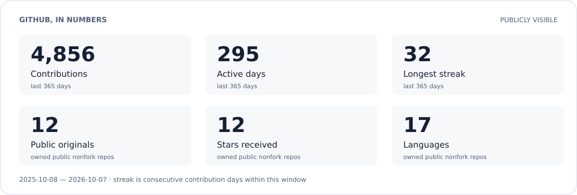
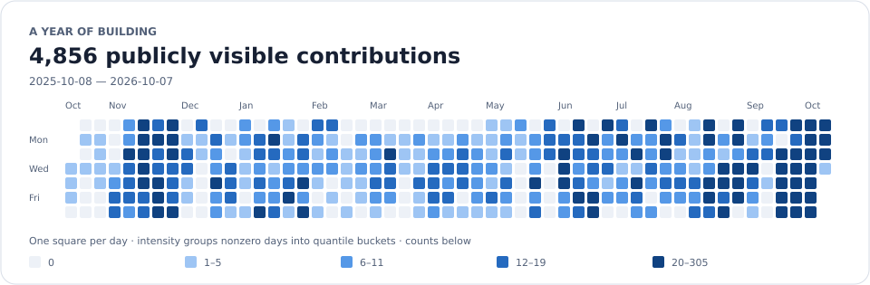
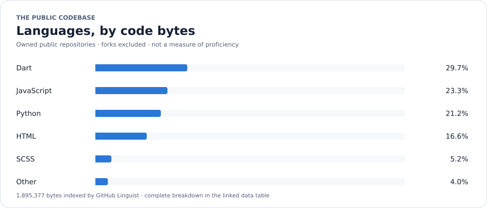

<a href="https://github.com/mehroj-r">
  <picture>
    <source media="(prefers-color-scheme: dark) and (max-width: 540px)" srcset="images/generated/banner-dark-mobile.svg" />
    <source media="(max-width: 540px)" srcset="images/generated/banner-light-mobile.svg" />
    <source media="(prefers-color-scheme: dark)" srcset="images/generated/banner-dark.svg" />
    
  </picture>
</a>

  Hi, I'm <strong>Mehroj Majidov</strong>. 
  Software Engineer from <strong>Uzbekistan</strong>, focused on building scalable software with <strong>Django</strong>.

  <i>I write code so my future self can question my life choices.</i>

  
  
  

## Tech

  
  
  
  
  

## Selected work

- **[django_boilerplate](https://github.com/mehroj-r/django_boilerplate)** — Branch-based Django REST API templates with independent setup and deployment guides.
- **[ym-bridge](https://github.com/mehroj-r/ym-bridge)** — Linux daemon bringing Yandex Music to native media controls through MPRIS, with mpv playback and Waybar integration.
- **[github-webhook](https://github.com/mehroj-r/github-webhook)** — GitHub-to-Telegram notifications built with FastAPI and aiogram, supporting polling and webhook deployment.

## Stats

Publicly visible GitHub contributions over the last 365 days. Anonymous private contribution totals may be included only if the account has opted into making them publicly visible.

<picture>
  <source media="(prefers-color-scheme: dark) and (max-width: 540px)" srcset="images/generated/stats-dark-mobile.svg" />
  <source media="(max-width: 540px)" srcset="images/generated/stats-light-mobile.svg" />
  <source media="(prefers-color-scheme: dark)" srcset="images/generated/stats-dark.svg" />
  
</picture>

<picture>
  <source media="(prefers-color-scheme: dark) and (max-width: 540px)" srcset="images/generated/activity-dark-mobile.svg" />
  <source media="(max-width: 540px)" srcset="images/generated/activity-light-mobile.svg" />
  <source media="(prefers-color-scheme: dark)" srcset="images/generated/activity-dark.svg" />
  
</picture>

Language byte composition in owned public, non-fork repositories — not a measure of expertise.

<picture>
  <source media="(prefers-color-scheme: dark) and (max-width: 540px)" srcset="images/generated/languages-dark-mobile.svg" />
  <source media="(max-width: 540px)" srcset="images/generated/languages-light-mobile.svg" />
  <source media="(prefers-color-scheme: dark)" srcset="images/generated/languages-dark.svg" />
  
</picture>

[Generated data tables and metric definitions](docs/github-stats.md) · [How this profile stays updated](docs/maintenance.md)
